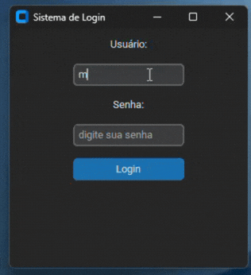
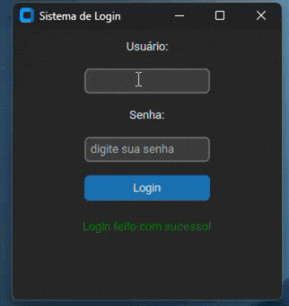
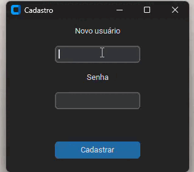

# 🚀 Projeto Login — Python c/ CustomTkinter

Sistema de login simples e elegante desenvolvido em **Python**, utilizando **CustomTkinter** para uma interface gráfica moderna.

---

## 💻 Sobre o projeto

Com o tutorial do canal Dev Aprender | Jhonatan de Souza.
Projeto criado para praticar Python e desenvolvimento de interfaces gráficas.  
Possui validação básica de usuário e senha com feedback visual direto na tela.

---

## ✨ Funcionalidades

- 🖤 Interface gráfica em dark mode  
- 👤 Campo de usuário  
- 🔐 Campo de senha protegido  
- ✅ Validação de login  
- 💬 Mensagem de sucesso ou erro

---

## 🛠️ Tecnologias utilizadas

- Python  
- CustomTkinter  
- SQLite (banco de dados local)  
---
## 📂 Estrutura do projeto
projeto-login/
│
├── main.py
├── .gitignore
├── README.md
├── database/
│ └── database.py
├── services/
│ └── usuario_service.py
└── ui/
├── login.py
└── cadastro.py

## Muito legal aprender na prática e com testes oque dá certo, a sintaxe da linguagem e as funcionalidades de cada biblioteca!!

## 🎥 Demonstração

| ✅ Login com sucesso | ❌ Login com erro |
|--------------------|------------------|
|  |  |

## ▶️ Como executar

1. Clone o repositório:
```bash
git clone https://github.com/maria-clra/projeto-login----Python-c-CustomTkinter.git

Instale a dependência:
pip install customtkinter

Execute o projeto:
python main.py

🔑 Credenciais de teste
Usuário: maria123
Senha: 123456

```
## 🎥 Demonstração

Atualização:
Cadastrar novo usuário


 

