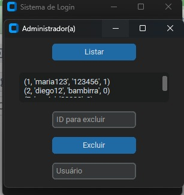

# 🚀 Projeto Login — Python c/ CustomTkinter

Sistema de login simples e elegante desenvolvido em **Python**, utilizando **CustomTkinter** para uma interface gráfica moderna.

---

## 💻 Sobre o projeto

Com o tutorial do canal Dev Aprender | Jhonatan de Souza.
Projeto criado para praticar Python e desenvolvimento de interfaces gráficas.  
Possui validação básica de usuário e senha com feedback visual direto na tela.

Em desenvolvimento: adicionei telas com a função de cadastrar novo usuario e o administrador do sistema conseguir excluir, listar e cadastrar usuarios no sistema.

---

## 🚀 Funcionalidades

*  Tela de login
*  Validação de usuário e senha
*  Cadastro de novos usuários
*  Troca de telas (login → sistema)
*  Interface gráfica moderna (CustomTkinter)

###  Área Administrativa

*  Listagem de usuários cadastrados
*  Inserção de novos usuários
*  Exclusão de usuários por ID
*  Integração com banco de dados SQLite

---

##  Conceitos aplicados

* Interface gráfica com CustomTkinter
* Manipulação de banco de dados com SQLite
* CRUD (Create, Read, Update, Delete)
* Organização de fluxo entre telas


##  Tecnologias utilizadas

- Python  
- CustomTkinter  
- SQLite (banco de dados local)
  
---
## 📂 Estrutura do projeto

projeto-login/
│
├── main.py
├── .gitignore
├── README.md
├── database/
│   └── database.py
├── services/
│   └── usuario_service.py
└── ui/
    ├── login.py
    └── cadastro.py

## Muito legal aprender na prática e com testes oque dá certo, a sintaxe da linguagem e as funcionalidades de cada biblioteca!!

## Login

| ✅ Login com sucesso | ❌ Login com erro |
|--------------------|------------------|
|  |  |

## Cadastro


## Área Administrativa




## ▶️ Como executar


1. Clone o repositório e entre na pasta:
```bash

git clone https://github.com/maria-clra/projeto-login----Python-c-CustomTkinter.git
```
2. Instale a dependência:
```bash
pip install customtkinter
```
3. Execute o projeto:
```bash
python main.py
```


📜 Licença

Este projeto está sob a licença MIT — sinta-se livre para usar, modificar e compartilhar.
